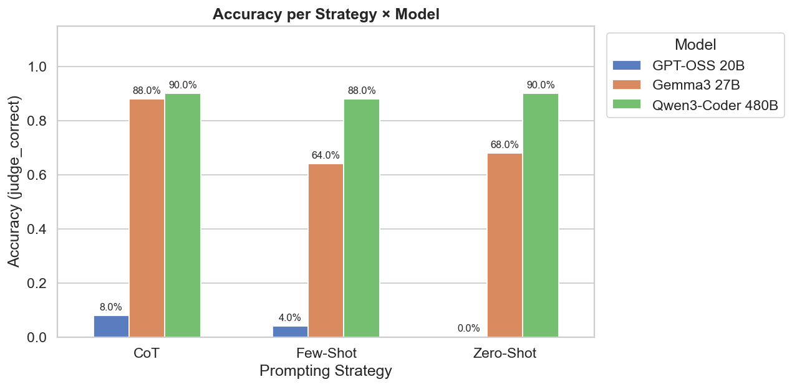
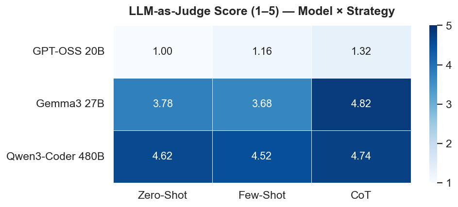
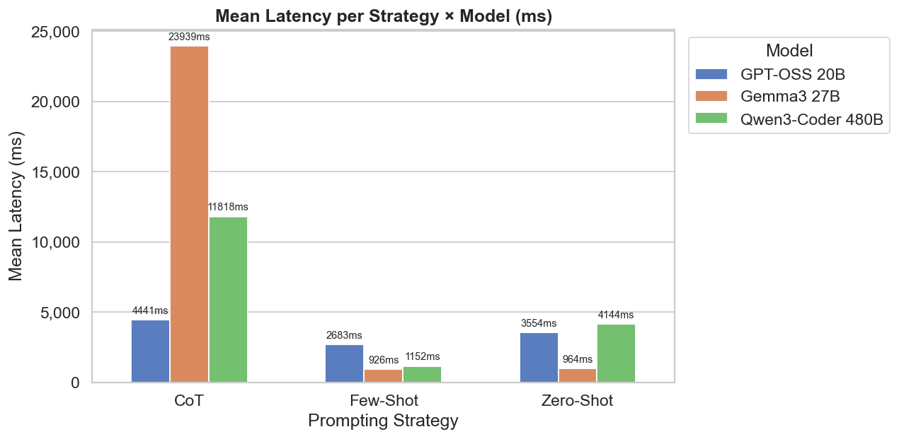
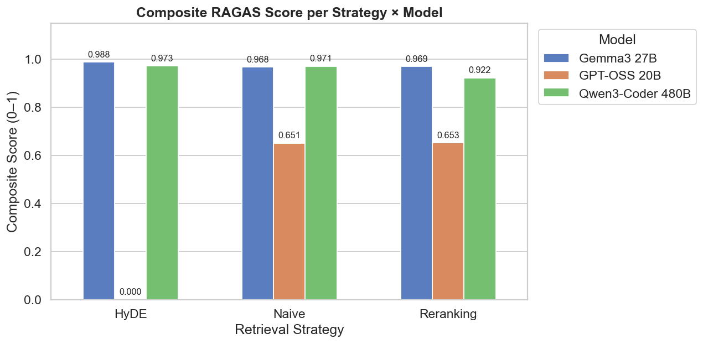
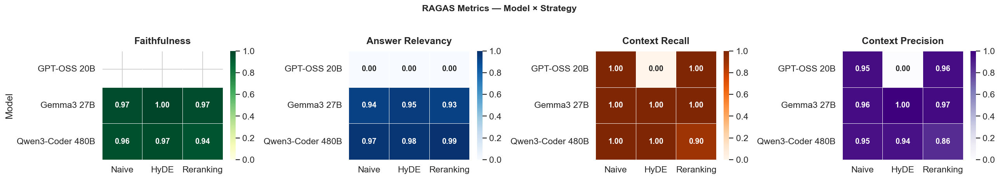

# llm-eval

<p align="left">
  
  
  
  
  
  
  
</p>

A framework for evaluating Large Language Models using **prompting strategies** (Zero-Shot, Few-Shot, Chain-of-Thought) and **RAG retrieval strategies** (Naive, HyDE, Reranking), with metrics from BLEU, ROUGE, LLM-as-Judge, and RAGAS.

---

## Project Structure

# llm-eval

A framework for evaluating Large Language Models using **prompting strategies** (Zero-Shot, Few-Shot, Chain-of-Thought) and **RAG retrieval strategies** (Naive, HyDE, Reranking), with metrics from BLEU, ROUGE, LLM-as-Judge, and RAGAS.

---

## Project Structure

```
llm-eval/
├── notebooks/
│   ├── 01_benchmark_analysis.ipynb   # Benchmark results analysis
│   └── 02_rag_comparison.ipynb       # RAG pipeline results analysis
├── scripts/
│   ├── run_benchmark.py              # CLI: benchmark runner
│   ├── evaluate_rag.py               # CLI: RAG evaluator
│   ├── ingest.py                     # CLI: document ingestion into ChromaDB
│   ├── populate_raw_docs.py          # CLI: populate raw document corpus
│   └── build_datasets.py             # CLI: build JSONL datasets
├── src/llm_eval/
│   ├── benchmark/
│   │   ├── evaluator.py              # BLEU, ROUGE, LLM-as-Judge logic
│   │   └── prompt_strategies/        # zero_shot, few_shot, chain_of_thought
│   ├── rag/
│   │   ├── rag_pipeline.py           # RAG orchestrator
│   │   └── strategies/               # naive, hyde, reranking
│   ├── clients/
│   │   ├── ollama_cliente.py         # Ollama local client
│   │   └── ollama_cloud_cliente.py   # Ollama Cloud client
│   ├── datasets/
│   │   ├── mmlu_sample.jsonl         # MMLU benchmark dataset
│   │   ├── curated_qa.jsonl          # Curated Q&A for RAG evaluation
│   │   └── raw/                      # Source documents (26 MMLU domains)
│   └── shared/
│       ├── config.py                 # Environment config
│       ├── langsmith_tracer.py       # LangSmith tracing
│       └── types.py                  # EvalResult, RAGResult types
├── results/                          # JSON + CSV outputs per model/strategy
├── docs/assets/                      # Charts and result images
├── chromadb/                         # Persisted ChromaDB vector store
├── tests/                            # Unit tests
└── .env                              # API keys and config (see below)
```

---

## Architecture

The project uses a **hybrid inference architecture**:

| Component | Backend | Model | Purpose |
|---|---|---|---|
| Generation | Ollama Cloud | Configurable via `.env` | Answer generation |
| Embeddings | Ollama Local | `nomic-embed-text` | Document & query embeddings |
| Judge (benchmark) | Ollama Cloud | Configurable via `.env` | LLM-as-Judge scoring |
| Judge (RAGAS) | Ollama Cloud | `qwen3-coder:480b` (default) | RAGAS metric evaluation |
| Vector Store | Local | ChromaDB | Document retrieval |

---

## Requirements

- Python 3.11+
- [uv](https://docs.astral.sh/uv/) (package manager)
- [Ollama](https://ollama.com/) running locally on `http://localhost:11434`
- Ollama Cloud API key ([get one here](https://ollama.com/settings/keys))

---

## Setup

### 1. Install dependencies

```bash
uv sync
```

### 2. Configure environment

Create a `.env` file at the project root:

```env
# Ollama Cloud
OLLAMA_API_KEY=your-ollama-cloud-key
OLLAMA_CLOUD_BASE_URL=https://api.ollama.com
OLLAMA_CLOUD_MODEL=qwen3-coder:480b-cloud

# Ollama Local
OLLAMA_BASE_URL=http://localhost:11434
OLLAMA_EMBED_MODEL=nomic-embed-text
OLLAMA_LLM_MODEL=llama3.1:8b

# Judge model for RAGAS (use a large model for stable parsing)
OLLAMA_JUDGE_MODEL=qwen3-coder:480b-cloud

# LangSmith (optional — for tracing)
LANGCHAIN_API_KEY=your-langsmith-key
LANGCHAIN_TRACING_V2=true
LANGCHAIN_PROJECT=llm-eval
```

### 3. Pull the models

```bash
ollama pull nomic-embed-text
ollama pull gpt-oss:20b-cloud
ollama pull gemma3:27b-cloud
ollama pull nomic-embed-text
```

---

## Usage

### Benchmark (Notebook 01)

```bash
# Run all prompting strategies
uv run run-benchmark --all-strategies --limit 50

# Run a specific strategy
uv run run-benchmark --strategy zero_shot --limit 25
uv run run-benchmark --strategy few_shot --limit 25
uv run run-benchmark --strategy chain_of_thought --limit 25
```

### RAG Evaluation (Notebook 02)

```bash
# Step 1 — Ingest documents
uv run ingest-docs

# Step 2 — Run RAG evaluation
uv run evaluate-rag
uv run evaluate-rag --strategy naive --model qwen3-coder:480b-cloud --limit 10
```

---

## Prompting Strategies

| Strategy | Description | Best for |
|---|---|---|
| **Zero-Shot** | Direct question, no examples | Large models with strong priors |
| **Few-Shot** | 3–5 solved examples prepended to the prompt | Format calibration |
| **Chain-of-Thought** | Instructs model to reason step-by-step | Smaller models on complex tasks |

---

## RAG Retrieval Strategies

| Strategy | Description | Extra cost |
|---|---|---|
| **Naive** | Direct query embedding → vector search → LLM | None |
| **HyDE** | LLM generates a hypothetical answer → embed → vector search → LLM | +1 LLM call |
| **Reranking** | Broad retrieval → cross-encoder reranks → top-N → LLM | +K cross-encoder calls |

---

## Results

### Benchmark — Accuracy



| Model | Zero-Shot | Few-Shot | CoT | Mean |
|---|---|---|---|---|
| **Qwen3-Coder 480B** | 90% | 88% | 90% | **89.3%** |
| Gemma3 27B | 68% | 64% | 88% | 73.3% |
| GPT-OSS 20B | 0% | 4% | 8% | 4% |

---

### Benchmark — LLM-as-Judge Score



> ⚠️ Judge Score measures **fluency and reasoning completeness**, not answer correctness. Use `judge_correct` (accuracy) as the primary metric.

---

### Benchmark — Mean Latency



---

### RAG — Composite RAGAS Score



| Model | Naive | HyDE | Reranking | Mean |
|---|---|---|---|---|
| **Gemma3 27B** | 0.968 | **0.988** | 0.969 | **0.975** |
| Qwen3-Coder 480B | 0.971 | 0.973 | 0.922 | 0.955 |
| GPT-OSS 20B | 0.651 | 0.000 | 0.653 | 0.435 |

---

### RAG — Individual RAGAS Metrics



---

### RAG — Context Recall Distribution


> ⚠️ Qwen3-Coder 480B shows a **bimodal distribution under Reranking** — the cross-encoder discards relevant chunks for some technical queries, causing context recall to drop near 0.

---

## Production Recommendations

| Use Case | Model | Strategy | Reason |
|---|---|---|---|
| MCQ / Reasoning tasks | Qwen3-Coder 480B | Zero-Shot | 90% accuracy at ~4.1s, no prompt engineering needed |
| RAG — max faithfulness | Gemma3 27B | HyDE | Composite 0.988, faithfulness 1.00 |
| RAG — low latency | Qwen3-Coder 480B | Naive | Composite 0.971, simplest pipeline |

---

## Known Limitations

- **ROUGE-L / BLEU are unreliable for MCQ+CoT** — long reasoning chains deflate scores against single-letter references. Use `judge_correct` as primary metric.
- **Judge Score measures fluency, not correctness** — always cross-reference with `judge_correct`.
- **HyDE collapses with weak models** — GPT-OSS 20B scores 0.000 composite with HyDE. Add a Naive fallback when the hypothesis is empty or malformed.
- **Reranking degrades Qwen3 context recall** — bimodal distribution suggests the cross-encoder discards relevant chunks for technical queries.

---

## Observability

LangSmith tracing is enabled when `LANGCHAIN_TRACING_V2=true`. Every LLM call is traced with strategy, model, prompt, response, `judge_score`, `judge_correct`, BLEU, ROUGE-L, and `latency_ms`.

View traces at [smith.langchain.com](https://smith.langchain.com).

---

## Tests

```bash
uv run pytest tests/ -v
```

---

## License

MIT
